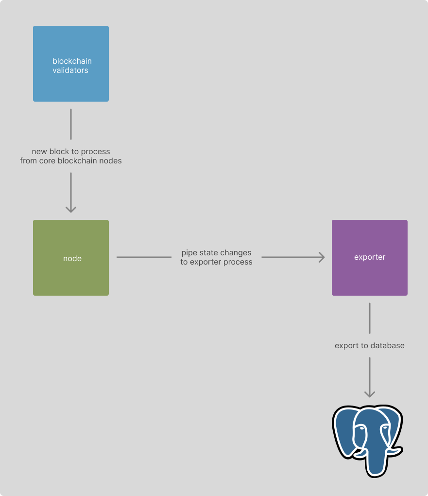

# Architecture

There are three pieces: the indexer, the API, Meilisearch, and Soketi.

### Indexer

The indexer is composed of an instrumented blockchain binary, represented in the
diagram above as `wasmd`, and an exporter process that runs alongside it. The
blockchain binary is modified to emit state changes as they occur to the
specified file (`wasm.out`), and the exporter listens for changes to the file
and writes them to a PostgreSQL database. Each line written to the file is a
JSON object representing a state change and its metadata, such as the contract
and block height.

Read the [exporter docs](./exporter.md) for more information on how the exporter
works and what its responsibilities are.

As the exporter is exporting, it also transforms data, updates the cache, and
triggers webhooks based on state changes. More information on each of these can
be found in their respective docs:

- [transformers docs](./transformers.md)
- [cache docs](./cache.md)
- [webhooks docs](./webhooks.md)

Read the [formulas docs](./formulas.md) for more information on how to write
formulas that can be used to query the database.

### API

The API is a simple Koa server that makes it easy to write endpoints that query
the database. More information can be found in the [API docs](./api.md).

### Meilisearch

This indexer is also capable of exporting data to a
[Meilisearch](https://www.meilisearch.com/) instance, which can be used to power
a search engine. If `meilisearch` is not defined in the config, this will be
disabled. It is optional.

### Soketi

This indexer is also capable of exporting data to a
[Soketi](https://docs.soketi.app/) instance, which can be used to power
WebSockets. This is only used by webhooks, and is optional. Check out the
[webhooks docs](./webhooks.md) for more information.
